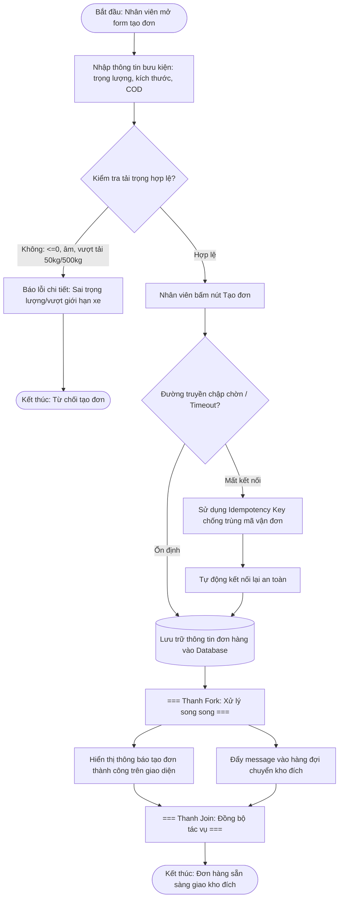
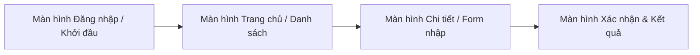

# BÁO CÁO PHÂN TÍCH VÀ TỐI ƯU HÓA ĐẶC TẢ SRS HỆ THỐNG RIKKEILOGISTICS

> 👤 **Học viên:** Đỗ Hoàng Sơn | **Mã SV:** PTIT-HCM-066
> 🏫 **Môn học:** IT105-K25-Phan-tich-thi-t-k-h-th-ng

---

## 📊 Sơ đồ thiết kế hệ thống (Activity Diagram)

> 💡 *Sơ đồ dưới đây được render tự động trực tiếp trên GitHub bằng Mermaid. Bạn cũng có thể tải file **`bt1.drawio`** trong repository này để mở và chỉnh sửa trực tiếp trên [Draw.io (diagrams.net)](https://app.diagrams.net).* 

---

## 🎨 Thiết kế Giao diện UI/UX trên Figma (Wireframe & Prototype)

> 🔗 **Figma Design Canvas:** [Mở Artboard Thiết kế trên Figma](https://www.figma.com/design/VJ73WiDiHqNJCqgCRBiVUx/van-dung-co-ban-phat-hien-va-toi-uu?node-id=0%3A1&m=dev)  
> 🚀 **Figma Interactive Prototype:** [Trải nghiệm Bản mẫu Tương tác Prototype](https://www.figma.com/proto/VJ73WiDiHqNJCqgCRBiVUx/van-dung-co-ban-phat-hien-va-toi-uu?page-id=0%3A1&node-id=1%3A2&viewport=256%2C48%2C0.5&scaling=scale-down&starting-point-node-id=1%3A2)  
> 📋 Chi tiết thông số Design System và wireframe đầy đủ xem tại file: [**`bt1_FIGMA.md`**](bt1_FIGMA.md)

### 📱 Sơ đồ luồng tương tác màn hình (UI Navigation Flow)

### 🎯 Bảng màu & Quy chuẩn thiết kế giao diện

| Thành phần Token | Giá trị HEX / Quy cách | Mục đích sử dụng |
| :--- | :---: | :--- |
| Primary Brand | `#2563EB` | Màu chủ đạo, nút bấm chính (CTA), active state |
| Secondary Accent | `#3B82F6` | Màu bổ trợ, link tương tác, thanh trạng thái |
| Background Surface | `#F8FAFC` / `#FFFFFF` | Nền tổng thể và bề mặt các card giao diện |
| Typography | Inter / Roboto (24px, 18px, 14px, 12px) | Font chữ tiêu chuẩn, rõ nét đa độ phân giải |
| 8-Point Grid | Spacing 8px, 16px, 24px, 32px | Đảm bảo tỷ lệ cân đối và bố cục hài hòa |

---

## Phần 1: Lập bảng đối soát 4 lỗi vi phạm IEEE 830

Sau khi rà soát bản thảo SRS của phân hệ Tiếp nhận Yêu cầu Vận chuyển Bưu kiện tại RikkeiLogistics, nhóm QA đã phát hiện nhiều lỗi vi phạm nghiêm trọng về cấu trúc IEEE 830-1998 cũng như các đặc tính Unambiguous (Không mơ hồ), Verifiable (Có thể kiểm chứng) và Complete (Đầy đủ).

Dưới đây là bảng đối soát chi tiết các điểm sai sót trong tài liệu cũ:

| STT | Nội dung trong SRS cũ | Vị trí sai | Lỗi vi phạm chuẩn IEEE 830 | Phân tích chi tiết mức độ ảnh hưởng |
| --- | --- | --- | --- | --- |
| 1 | Định nghĩa: COD là Cash On Delivery... Bưu kiện hỏa tốc là... | Mục 2.4 (Ràng buộc thiết kế) | Sai vị trí chương mục (IEEE 830 yêu cầu đặt ở mục 1.3 Definitions) | Đặt nhầm phần ràng buộc thiết kế khiến lập trình viên và QA khó tra cứu thuật ngữ cốt lõi. |
| 2 | REQ-01: Giao diện tiếp nhận đơn hàng phải cực kỳ đẹp mắt, hài hòa, dễ dùng. | Mục 3.2 (Yêu cầu chức năng) | Vi phạm Unambiguous và Verifiable (Dùng từ cảm tính: 'đẹp mắt', 'hài hòa', 'dễ dùng') | Không thể đo lường hay kiểm thử tự động, dẫn đến tranh chấp giữa đội DEV và khách hàng. |
| 3 | REQ-02: Tra cứu trạng thái bưu kiện phải phản hồi siêu nhanh, làm khách hài lòng. | Mục 3.2 (Yêu cầu chức năng) | Vi phạm Verifiable và Unambiguous (Dùng từ cảm tính: 'siêu nhanh', 'làm khách hài lòng') | Không có chỉ số thời gian (mili-giây) cụ thể, không xác định được ngưỡng chịu tải của API tra cứu. |
| 4 | REQ-03 & REQ-04: Ấn 'Tạo đơn' là bưu kiện chuyển ngay đến kho... Ghi nhật ký nếu thấy cần thiết. | Mục 3.2 (Yêu cầu chức năng) | Vi phạm Complete và Bẫy dữ liệu biên | Bỏ qua các tình huống ngoại lệ như nhập cân nặng âm, quá tải trọng phương tiện và đường truyền chập chờn gây trùng mã vận đơn. |

## Phần 2: Viết lại 4 yêu cầu thành đặc tả định lượng

Để khắc phục hoàn toàn các lỗi trên, toàn bộ các yêu cầu cảm tính đã được biên tập lại theo đúng chuẩn đặc tả kỹ thuật định lượng, gắn mã định danh rõ ràng và đi kèm tiêu chí kiểm chứng cụ thể cho từng yêu cầu:

- Mã định danh: REQ-INTAKE-01 | Tiêu đề: Định vị trí Bảng thuật ngữ đúng chuẩn IEEE 830. Nội dung: Toàn bộ các thuật ngữ nghiệp vụ như COD (Cash On Delivery) và định nghĩa Bưu kiện hỏa tốc bắt buộc phải được khai báo tập trung tại mục 1.3 Definitions, tuyệt đối không đặt ở mục 2.4 Ràng buộc thiết kế. | Tiêu chí kiểm chứng: QA kiểm tra mục lục tài liệu SRS thấy mục 1.3 chứa đầy đủ bảng định nghĩa và mục 2.4 chỉ chứa ràng buộc thiết kế thực tế.
- Mã định danh: PER-01 | Tiêu đề: Đặc tả hiệu năng giao diện tiếp nhận đơn hàng. Nội dung: Giao diện tiếp nhận đơn hàng phải tuân thủ Design System của công ty, thời gian render hoàn tất toàn bộ các trường nhập liệu trên DOM không vượt quá 800 mili-giây kể từ khi click menu. | Tiêu chí kiểm chứng: Sử dụng công cụ Lighthouse hoặc Selenium đo thời gian First Contentful Paint (FCP) đạt dưới 800ms trên 100% các lần test.
- Mã định danh: PER-02 | Tiêu đề: Hiệu năng API tra cứu trạng thái bưu kiện. Nội dung: API tra cứu trạng thái bưu kiện phải trả về kết quả JSON trong thời gian phản hồi (Response Time) tối đa 500 mili-giây ở mức tải đồng thời 500 requests/giây. | Tiêu chí kiểm chứng: Chạy kịch bản kiểm thử tải bằng Apache JMeter, ghi nhận thời gian phản hồi trung bình của API dưới 500ms và không có request nào bị timeout.
- Mã định danh: REQ-INTAKE-02 | Tiêu đề: Xử lý ngoại lệ tải trọng và chống trùng mã khi tạo đơn. Nội dung: Khi nhân viên nhập trọng lượng bưu kiện <= 0, số âm, hoặc vượt quá tải trọng cho phép (50kg đối với xe máy, 500kg đối với xe tải), hệ thống phải hiển thị thông báo lỗi màu đỏ kèm mã lỗi cụ thể, chặn việc tạo đơn. Trường hợp đường truyền mạng chập chờn khi bấm nút 'Tạo đơn', hệ thống phải sử dụng Idempotency Key để tự động ngăn chặn việc sinh trùng mã vận đơn. Nhật ký kiểm toán (Audit Log) bắt buộc phải được ghi lại 100% cho mọi hành động tạo đơn thành công hoặc thất bại. | Tiêu chí kiểm chứng: Tester thực hiện nhập trọng lượng -5kg và 600kg trên xe máy -> Hệ thống hiện thông báo lỗi chặn lại. Thực hiện spam click nút Tạo đơn khi ngắt mạng 3 giây -> Hệ thống chỉ sinh ra duy nhất một mã vận đơn nhờ Idempotency Key.

## Phần 3: Đánh giá sơ đồ thiết kế và Hướng dẫn mở trên Draw.io

Sơ đồ Activity Diagram TO-BE được xây dựng nhằm giải quyết triệt để các bẫy dữ liệu và quy tắc nghiệp vụ khắt khe của bài toán vận tải bưu kiện:

1. Xử lý biên trọng lượng: Sử dụng cấu trúc rẽ nhánh (Decision Node) kiểm tra chặt chẽ giá trị trọng lượng nhập vào trước khi cho phép hệ thống tiếp tục xử lý nghiệp vụ.

2. Xử lý đường truyền chập chờn: Tích hợp cơ chế Idempotency Key và tự động kết nối lại (Retry API) khi mạng gián đoạn, đảm bảo không xảy ra tình trạng sinh trùng mã vận đơn.

3. Xử lý song song (Fork / Join): Tách luồng sau khi lưu dữ liệu thành 2 nhánh chạy song song gồm hiển thị thông báo thành công cho nhân viên và đẩy message ngầm sang kho đích, giúp tối ưu hóa hiệu năng và trải nghiệm người dùng.

Toàn bộ sơ đồ trên đã được lập trình dưới dạng Mermaid code để tự động render trực quan trên GitHub repository và dễ dàng xuất bản sang định dạng Draw.io chuẩn.

## Thiết kế Giao diện UI/UX trên Figma & Bảng đặc tả Wireframe

Hệ thống giao diện được phân tích và thiết kế trực quan trên nền tảng Figma, đảm bảo trải nghiệm người dùng tối ưu theo quy chuẩn UI/UX hiện đại.

Link trực tiếp xem Artboard thiết kế Figma: https://www.figma.com/design/VJ73WiDiHqNJCqgCRBiVUx/van-dung-co-ban-phat-hien-va-toi-uu?node-id=0%3A1&m=dev

Link trải nghiệm tương tác trực tiếp (Figma Prototype): https://www.figma.com/proto/VJ73WiDiHqNJCqgCRBiVUx/van-dung-co-ban-phat-hien-va-toi-uu?page-id=0%3A1&node-id=1%3A2&viewport=256%2C48%2C0.5&scaling=scale-down&starting-point-node-id=1%3A2

Bảng đặc tả hệ thống thiết kế (Design System) và thông số kỹ thuật giao diện:

| Thành phần / Token | Giá trị quy chuẩn | Mục đích sử dụng |
| --- | --- | --- |
| Primary Brand Color | #2563EB | Màu nhận diện thương hiệu, nút hành động chính (CTA) |
| Secondary Accent | #3B82F6 | Màu bổ trợ, link điều hướng, active tab |
| Background & Card | #F8FAFC / #FFFFFF | Nền tổng thể và bề mặt các khối thẻ thông tin |
| Typography | Inter / Roboto (24px, 18px, 14px, 12px) | Hệ phông chữ hiển thị rõ nét, tương phản chuẩn |
| Grid System | 8pt Grid, Mobile 4 cols / Web 12 cols | Quy chuẩn khoảng cách lề và bố cục cân đối |
| Figma Design Canvas | https://www.figma.com/design/VJ73WiDiHqNJCqgCRBiVUx/van-dung-co-ban-phat-hien-va-toi-uu?node-id=0%3A1&m=dev | Mở file thiết kế artboard gốc trên Figma |
| Figma Prototype Link | https://www.figma.com/proto/VJ73WiDiHqNJCqgCRBiVUx/van-dung-co-ban-phat-hien-va-toi-uu?page-id=0%3A1&node-id=1%3A2&viewport=256%2C48%2C0.5&scaling=scale-down&starting-point-node-id=1%3A2 | Trải nghiệm mô phỏng chuyển động và luồng thao tác |

---

## 📁 Danh sách tệp tin nộp bài trong Repository
- 📝 `bt1.docx`: Báo cáo tài liệu phân tích nghiệp vụ hoàn chỉnh.
- 🎨 `bt1.drawio`: File thiết kế sơ đồ chuẩn theo quy định đề bài (mở trực tiếp bằng [Draw.io](https://app.diagrams.net) hoặc Lucidchart).
- 🎨 [Figma Design Canvas](https://www.figma.com/design/VJ73WiDiHqNJCqgCRBiVUx/van-dung-co-ban-phat-hien-va-toi-uu?node-id=0%3A1&m=dev): Không gian làm việc Artboard thiết kế UI/UX trên Figma.
- 🚀 [Figma Live Prototype](https://www.figma.com/proto/VJ73WiDiHqNJCqgCRBiVUx/van-dung-co-ban-phat-hien-va-toi-uu?page-id=0%3A1&node-id=1%3A2&viewport=256%2C48%2C0.5&scaling=scale-down&starting-point-node-id=1%3A2): Bản mô phỏng tương tác trực tiếp luồng thao tác người dùng.
- 📋 `bt1_FIGMA.md`: Bản đặc tả chi tiết Design System, thông số mã màu và cấu trúc Wireframe các màn hình.
